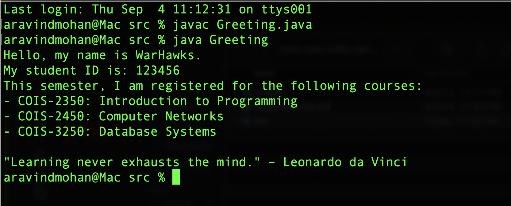

# mcm-cois-2350-fall-2024-week2

Write a simple Java program by modifying the starter code in the file named "Greeting.java" to do the following:

Display the messages exactly as shown in the sample output file named "sample-output.png" in the activity repository by using a separate output statement for each line of output. 


The given output is providing the instructor's name and teaching schedule. Make sure to provide your name and your class schedule while implementing this little tool in Java. The sample output is also displayed at the end of this document!

The commands for executing the starter code file is provided below:

```
javac Greeting.java
java Greeting
```

The commands for submitting the completed activity is provided below:

```
git add .
git commit -m "submitting completed work for week2!"
git push
```

## Sample Output:



